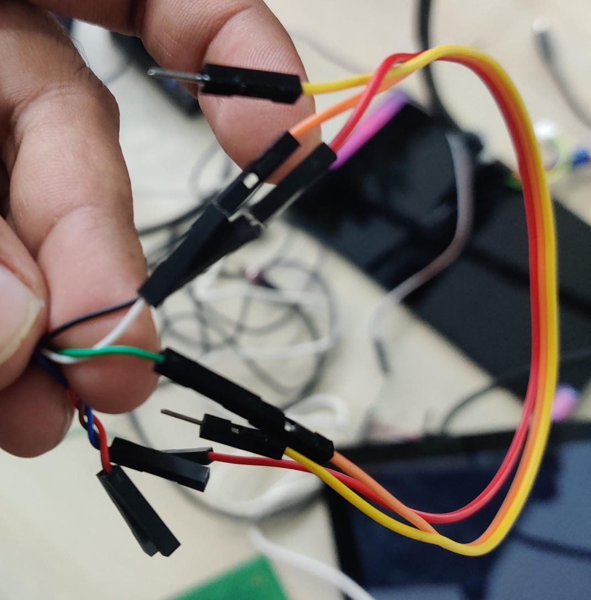

## USB SERIAL COMMUNICATION USING UART

- Library used for serial comm - `jSerialComm` 
- Link : `http://github.com/Fazecast/jSerialComm`
- Device used : `FT232 Serial by FTDI`
- Port used : `ttyUSB0`
- You can use minicom to set the baud Rate, dataBits , stopBits , Parity according to requirement.
  - For linux - to open minicom : `sudo minicom -s`
  
- `NOTE`: Please see the image below. To illustrate how Tx (transmission) and Rx (reception) works , I have short Tx and Rx wire .

## Image 

